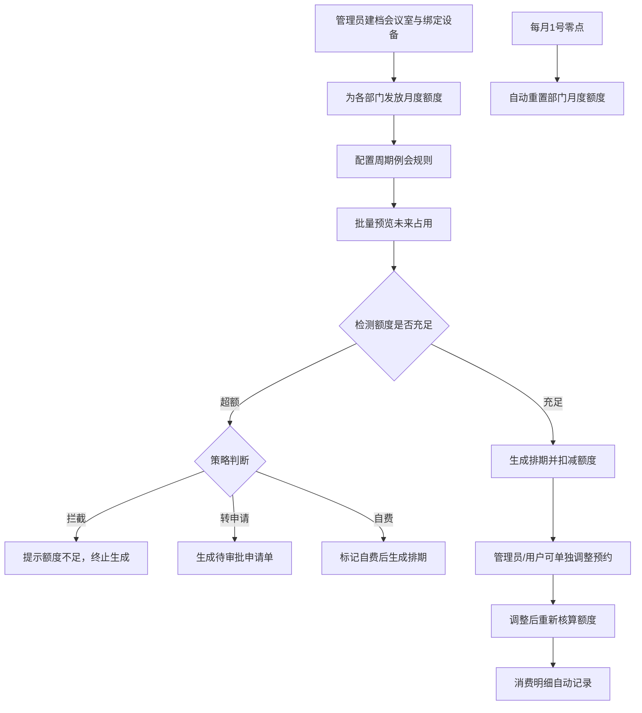

## 1. 产品概述

企业会议室预约管理系统，面向企业行政与各部门管理人员，解决会议室资源调度效率低、周期例会重复预约、额度管控不透明等核心痛点，提供从会议室建档、周期规则配置、批量占用生成到月度额度管控与消费全链路的数字化管理能力。

## 2. 核心功能

### 2.1 用户角色

| 角色 | 注册方式 | 核心权限 |
|------|----------|----------|
| 系统管理员 | 默认内置 | 会议室建档、设备绑定、全量额度管控、所有模块操作 |
| 部门管理员 | 默认内置 | 本部门周期规则配置、额度使用申请、预约调整 |
| 普通用户 | 默认内置 | 查看排期、申请预约、查看本部门消费明细 |

### 2.2 功能模块

1. **会议室排期模块**：周/月视图日历、会议室建档、投屏设备绑定、预约拖拽调整、冲突检测
2. **周期生成模块**：周期规则设定（每周固定日/间隔N天）、批量预览生成、规则启停、单独修改例外
3. **额度管控模块**：部门月度额度发放、实时额度余额看板、超额拦截/转申请、每月额度重置
4. **消费明细模块**：预约消费记录、超额自费标记、按部门/会议室/时间段多维筛选、统计汇总

### 2.3 页面详情

| 页面名称 | 模块名称 | 功能描述 |
|----------|----------|----------|
| 会议室排期页 | 日历视图 | 周视图时间轴展示所有会议室占用，支持日期切换、拖拽调整预约时间 |
| 会议室排期页 | 会议室建档 | 新建/编辑会议室：名称、容纳人数、位置、设备列表、每小时费率 |
| 会议室排期页 | 投屏设备绑定 | 设备清单与会议室绑定，支持启用/停用设备 |
| 周期生成页 | 规则列表 | 展示所有周期规则，支持启停、编辑、删除 |
| 周期生成页 | 规则配置 | 选择部门/会议室/开始结束时间/周几/重复周期/生效范围 |
| 周期生成页 | 批量生成预览 | 生成未来N周的占用预览，可单条取消后确认生成 |
| 额度管控页 | 额度看板 | 各部门当月额度总览（总额/已用/剩余/超额） |
| 额度管控页 | 额度发放 | 为部门分配月度额度，支持临时追加 |
| 额度管控页 | 策略配置 | 超额行为（拦截/申请/自费）、自动重置开关 |
| 消费明细页 | 明细列表 | 所有预约消费记录，支持多维筛选与排序 |
| 消费明细页 | 自费转换 | 超额预约标记为自费，填写报销人信息 |
| 消费明细页 | 统计图表 | 按部门/会议室的消费柱状图与趋势图 |

## 3. 核心流程

## 4. 用户界面设计

### 4.1 设计风格

- **主色调**：深海蓝 (#1e3a8a) 搭配金属青 (#0d9488) 双主色，体现企业级稳重与专业
- **辅助色**：琥珀 (#f59e0b) 标记预警/超额状态，祖母绿 (#10b981) 标记正常/可用
- **背景与卡片**：冷灰渐变背景 (#f8fafc → #eef2f7)，卡片采用 12px 圆角 + 柔和投影 + 1px 描边
- **按钮风格**：圆角 8px，主色按钮带轻微渐变与悬停上浮 1px 动画
- **字体**：标题使用"思源宋体 SemiBold"体现正式感，正文使用"PingFang SC / Microsoft YaHei"，数字等宽字体
- **图标**：Lucide 线性图标，统一 18px 尺寸，颜色继承文本色
- **整体气质**：企业级 B 端后台风格，信息密度适中，大量使用表格、数据看板、日历组件

### 4.2 页面设计概览

| 页面名称 | 模块名称 | UI 元素 |
|----------|----------|----------|
| 会议室排期页 | 顶部导航栏 | 品牌 Logo、四大模块 Tabs 切换、用户头像下拉 |
| 会议室排期页 | 日历视图 | 左侧会议室列表（滚动）、顶部日期切换（周导航）、主体时间轴网格（08:00-20:00，每格 30 分钟）、色块标记占用 |
| 会议室排期页 | 建档弹窗 | 两列表单布局、输入框带图标前缀、保存/取消底部操作栏 |
| 周期生成页 | 规则卡片 | 规则列表采用卡片瀑布，状态徽标（运行/停用）、核心信息紧凑排版 |
| 周期生成页 | 预览表格 | 生成预览用时间表格展示，支持行勾选取消、批量确认按钮固定底部 |
| 额度管控页 | 数据看板 | 四色统计卡片+部门环形进度条图表+超额预警列表 |
| 额度管控页 | 发放弹窗 | 部门选择下拉 + 额度数字输入 + 备注多行文本 |
| 消费明细页 | 明细表格 | 斑马纹表格、固定表头、多维筛选工具栏、列排序 |
| 消费明细页 | 统计区 | 可折叠的图表区，部门消费柱状图 + 月度趋势折线图 |

### 4.3 响应式

- **桌面优先设计**：最小支持 1366×768 分辨率，主区域 12 列栅格
- **平板适配**：1024px 断点，侧边导航收起为图标模式，日历视图简化时间刻度
- **移动端**：768px 断点，模块切换为底部 Tab 栏，日历转为单日列表视图，表格横向滚动
- **交互优化**：所有可点击区域最小 44px，触控设备支持双指缩放日历视图

