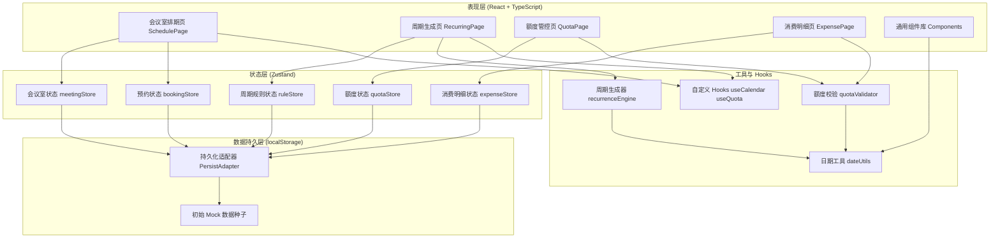
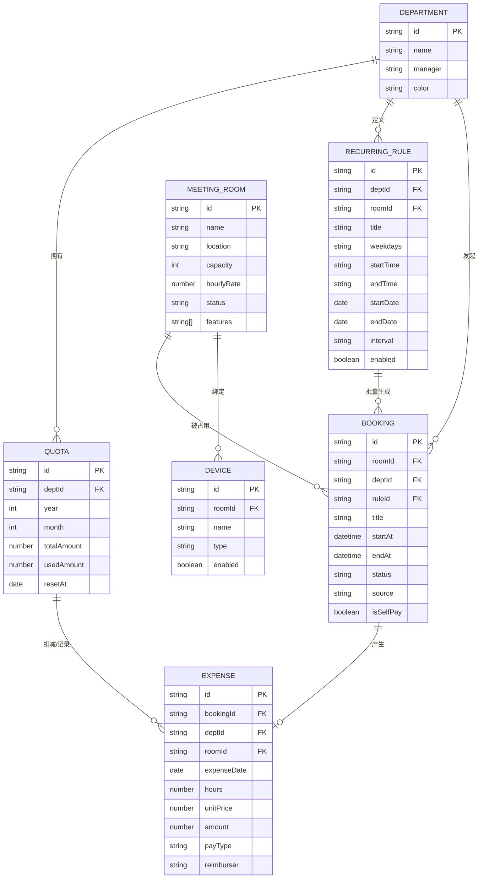

## 1. 架构设计



## 2. 技术描述

- **前端框架**：React@18 + TypeScript + Vite@5
- **UI 样式**：TailwindCSS@3 + CSS 变量（主题系统）
- **状态管理**：Zustand@4（含 persist 中间件持久化至 localStorage）
- **路由**：React Router DOM@6
- **图标库**：Lucide React
- **图表库**：Recharts（轻量级 SVG 图表）
- **日期处理**：date-fns（轻量工具函数集）
- **后端**：无（纯前端，localStorage 模拟数据存储）
- **数据**：内置丰富 Mock 数据（10 个会议室、5 个部门、周期规则示例、历史消费记录）

## 3. 路由定义

| 路由路径 | 页面组件 | 用途说明 |
|----------|----------|----------|
| `/` | 重定向至 `/schedule` | 首页默认跳转到排期页 |
| `/schedule` | SchedulePage | 会议室排期与建档管理 |
| `/recurring` | RecurringPage | 周期规则配置与批量生成 |
| `/quota` | QuotaPage | 部门额度管控与策略配置 |
| `/expense` | ExpensePage | 消费明细查看与统计 |

## 4. 数据模型

### 4.1 实体关系图



### 4.2 核心类型定义

```typescript
// 部门
interface Department {
  id: string;
  name: string;
  manager: string;
  color: string;
}

// 会议室
interface MeetingRoom {
  id: string;
  name: string;
  location: string;
  capacity: number;
  hourlyRate: number;
  status: 'active' | 'maintenance';
  features: string[];
}

// 投屏设备
interface Device {
  id: string;
  roomId: string;
  name: string;
  type: 'projector' | 'tv' | 'whiteboard' | 'camera';
  enabled: boolean;
}

// 周期规则
interface RecurringRule {
  id: string;
  deptId: string;
  roomId: string;
  title: string;
  weekdays: number[]; // 0-6
  startTime: string; // 'HH:mm'
  endTime: string;
  startDate: string; // 'YYYY-MM-DD'
  endDate: string;
  interval: 'weekly' | 'biweekly';
  enabled: boolean;
}

// 预约
interface Booking {
  id: string;
  roomId: string;
  deptId: string;
  ruleId?: string;
  title: string;
  startAt: string; // ISO datetime
  endAt: string;
  status: 'confirmed' | 'cancelled' | 'pending';
  source: 'manual' | 'recurring';
  isSelfPay: boolean;
}

// 额度
interface Quota {
  id: string;
  deptId: string;
  year: number;
  month: number;
  totalAmount: number;
  usedAmount: number;
  resetAt: string;
}

// 消费明细
interface Expense {
  id: string;
  bookingId: string;
  deptId: string;
  roomId: string;
  expenseDate: string;
  hours: number;
  unitPrice: number;
  amount: number;
  payType: 'quota' | 'selfpay';
  reimburser?: string;
}
```

## 5. 核心模块职责

| 模块文件 | 职责 |
|----------|------|
| `src/stores/meetingStore.ts` | 会议室、设备、部门的 CRUD 与状态管理 |
| `src/stores/bookingStore.ts` | 预约创建/修改/取消、冲突检测、周期生成联动 |
| `src/stores/ruleStore.ts` | 周期规则管理、批量生成预览逻辑 |
| `src/stores/quotaStore.ts` | 额度发放、扣减、重置、超额策略判断 |
| `src/stores/expenseStore.ts` | 消费明细记录、自费转换、统计聚合 |
| `src/utils/recurrenceEngine.ts` | 核心周期算法，根据规则生成指定范围内的所有日期时间对 |
| `src/utils/quotaValidator.ts` | 额度校验器，判断操作是否超额并返回策略结果 |
| `src/utils/dateUtils.ts` | 日期格式化、周计算、区间交集等工具函数 |
| `src/hooks/useCalendar.ts` | 日历视图计算 Hook，网格数据生成、拖拽逻辑 |
| `src/hooks/useQuota.ts` | 额度查询 Hook，聚合计算部门额度状态 |

